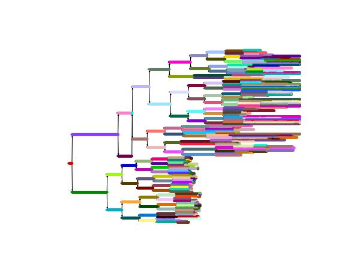
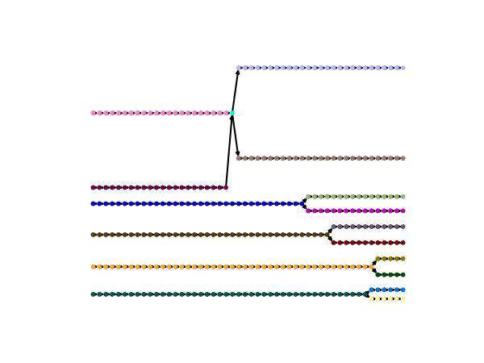
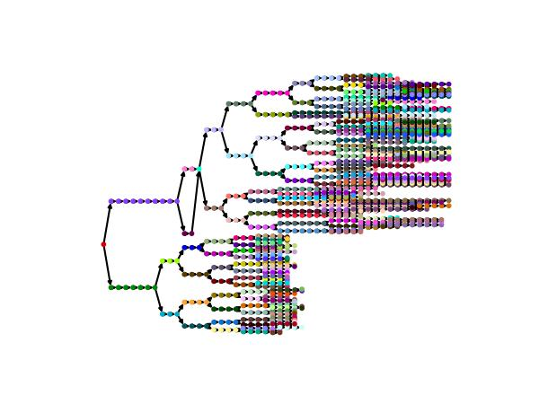
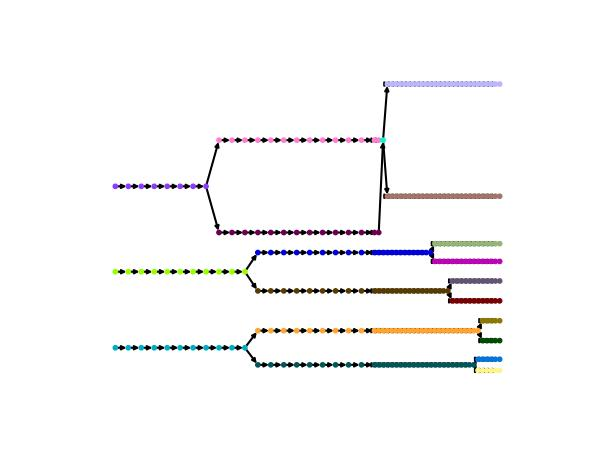
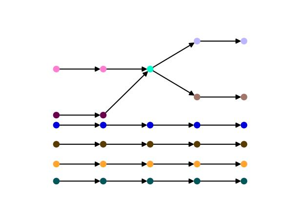
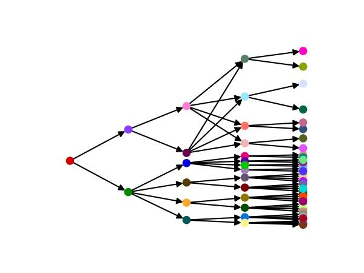
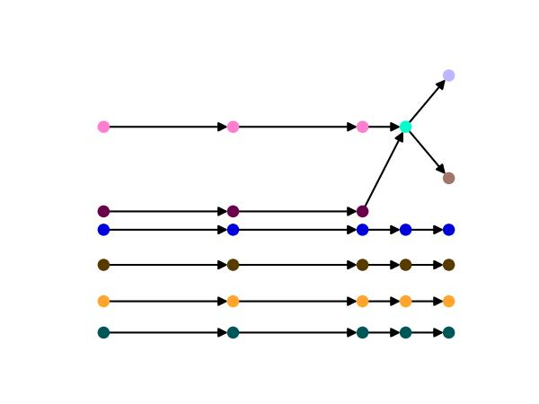

# OME-Zarr live imaging dataset example for Zenodo
This repository contains a timelapse movie including segmentation and tracks from the publication [Multiscale light-sheet organoid imaging framework](https://doi.org/10.1038/s41467-022-32465-z) converted to OME-Zarr and related specs (GEFF for lineage tree, ngio table for timestamps & DCA for additional metadata).

## Datasets
To facilitate access for different use-cases the original dataset (`001-full`) has been downsampled/sliced. 

| Dataset Name   | T Shape | Size on Disk | T-Slice / Indices                                  | Notes                                    |               Lineage Tree Plot                |
| -------------- | ------- | ------------ | -------------------------------------------------- | ---------------------------------------- | :--------------------------------------------: |
| 001-full       | 667     | 38.1 GB      | `slice(None)`                                      | Full dataset.                            |        |
| 001-small      | 50      | 2.5 GB       | `slice(160, 210, 1)`                               | Contiguous slice.                        |       |
| 001-small-lowT | 48      | 2.6 GB       | `slice(0, None, 14)`                               | Every 14th frame.                        |  |
| 001-small-varT | 50      | 2.4 GB       | `list(range(120, 180, 3)) + list(range(180, 210))` | Variable rate (every 3rd -> contiguous). |  |
| 001-mini       | 5       | 0.3 GB       | `slice(180, 185, 1)`                               | Contiguous slice.                        |        |
| 001-mini-lowT  | 5       | 0.3 GB       | `slice(0, 400, 80)`                                | Every 80th frame up to 400.              |   |
| 001-mini-varT  | 5       | 0.3 GB       | `[175, 178, 181, 182, 183]`                        | Variable rate (every 3rd -> contiguous). |   |

## Dataset components
All datasets contain identical components and include tracking graphs with cell-divisions and mergers.

| Component            | Path                                        | Type                         | Spec                                                                                  | Notes                                                                                   |
| -------------------- | ------------------------------------------- | ---------------------------- | ------------------------------------------------------------------------------------- | --------------------------------------------------------------------------------------- |
| raw image            | `raw.ome.zarr`                              | multiscale (t, c, z, y, x)   | [OME-Zarr v0.5](https://ngff.openmicroscopy.org/specifications/0.5/index.html)        |                                                                                         |
| deconvolved image    | `deconv.ome.zarr`                           | multiscale (t, c, z, y, x)   | [OME-Zarr v0.5](https://ngff.openmicroscopy.org/specifications/0.5/index.html)        | Two OME-Zarr images share physical coordinate system.                                   |
| nucleus segmentation | `deconv.ome.zarr/labels/nucleus`            | multiscale (t, z, y, x)      | [OME-Zarr v0.5](https://ngff.openmicroscopy.org/specifications/0.5/index.html)        | Labels are written to the OME-Zarr they have been derived from but apply to all.        |
| cell segmentation    | `deconv.ome.zarr/labels/cell`               | multiscale (t, z, y, x)      | [OME-Zarr v0.5](https://ngff.openmicroscopy.org/specifications/0.5/index.html)        |                                                                                         |
| lumen segmentation   | `deconv.ome.zarr/labels/lumen`              | multiscale (t, z, y, x)      | [OME-Zarr v0.5](https://ngff.openmicroscopy.org/specifications/0.5/index.html)        |                                                                                         |
| posix timestamps     | `deconv.ome.zarr/tables/timestamps`         | ngio:generic-table (parquet) | [ngio table](https://biovisioncenter.github.io/ngio/stable/table_specs/overview/)     | `t_idx` index into t-axis of array; `posix_timestamp` posix epoch in seconds (`float`). |
| lineage tree         | `deconv.ome.zarr/tracks/nucleus.geff`       | geff:tracks                  | [GEFF v1.2](https://liveimagetrackingtools.org/geff/v1.3.0.1.2/specification/)        | Additional features stored as node/edge properties.                                     |
| DCA metadata         | `<image>.ome.zarr/zarr.json:attributes:dca` | json blob                    | [DCA v0.2](https://chanzuckerberg.github.io/dynamic-cell-atlas-specs/v0.2/index.html) | Experiment metadata, channel metadata and normalization statistics from DCA specs.      |
| additional DCA meta  | `<image>.ome.zarr/tables/obs`               | dca:table                    | [DCA v0.2](https://chanzuckerberg.github.io/dynamic-cell-atlas-specs/v0.2/index.html) | Additional metadata components that did not make it to the json.                        |
| raw mip              | `raw_mip-z.ome.zarr`                        | multiscale (t, c, z:1, y, x) | [OME-Zarr v0.5](https://ngff.openmicroscopy.org/specifications/0.5/index.html)        | Maximum intensity projection along z.                                                   |
| deconvolved mip      | `deconv_mip-z.ome.zarr`                     | multiscale (t, c, z:1, y, x) | [OME-Zarr v0.5](https://ngff.openmicroscopy.org/specifications/0.5/index.html)        | Maximum intensity projection along z, labels not projected.                             |